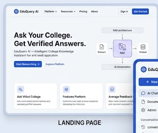
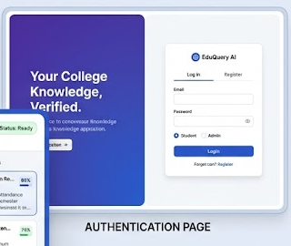
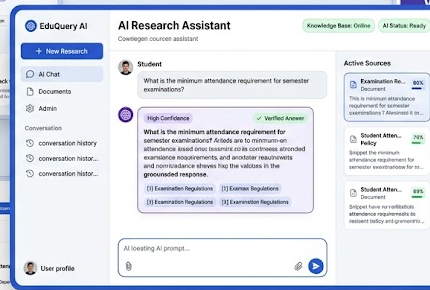
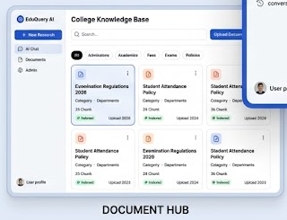
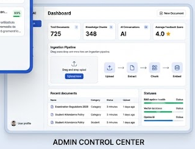

# EduQuery AI — Intelligent College Knowledge Assistant

> **An AI-Powered Retrieval-Augmented Generation (RAG) Platform for Educational Institutions**

[](https://github.com/arun-kavali/EduQuery-AI-Intelligent-College-Knowledge-Assistant)
[](LICENSE)
[](https://react.dev/)
[](https://nodejs.org/)
[](https://supabase.com/)
[](https://aistudio.google.com/)

EduQuery AI is an enterprise-grade Retrieval-Augmented Generation (RAG) platform engineered for universities, colleges, and academic institutions. It transforms static campus documents—such as official academic handbooks, course syllabi, fee structures, examination regulations, housing policies, and department circulars—into an interactive vector knowledge base.

By combining vector semantic search using Supabase PostgreSQL (`pgvector`) with Google Gemini Large Language Models, EduQuery AI provides immediate, context-grounded AI answers backed by verifiable document source citations.

---

## 1. Project Name

### EduQuery AI — Intelligent College Knowledge Assistant

EduQuery AI transforms official academic documents into an intelligent, searchable vector knowledge base and provides context-grounded answers with source citations.

- **GitHub Repository:** [https://github.com/arun-kavali/EduQuery-AI-Intelligent-College-Knowledge-Assistant](https://github.com/arun-kavali/EduQuery-AI-Intelligent-College-Knowledge-Assistant)
- **Git Clone URL:** `https://github.com/arun-kavali/EduQuery-AI-Intelligent-College-Knowledge-Assistant.git`

---

## 2. Problem Statement

Educational institutions maintain hundreds of multi-page policy manuals, syllabus PDFs, and administrative notices every semester across fragmented portals.

- **Information Asymmetry:** Students, faculty members, and campus staff struggle to find accurate, up-to-date answers buried inside 50+ page PDFs.
- **Keyword Search Limitations:** Traditional search tools rely on exact keyword matching, failing to understand natural language questions.
- **Generative AI Hallucinations:** Un-grounded AI chatbots invent fake campus deadlines, incorrect fee structures, or non-existent academic rules.
- **Administrative Workload:** University support desks spend thousands of hours responding to repetitive student inquiries.

### The Solution

EduQuery AI implements a strict Retrieval-Augmented Generation (RAG) pipeline:

1. **Document Ingestion:** Administrators upload official college PDFs, Word documents (`.docx`), or text files (`.txt`).
2. **Text Parsing & Extraction:** Text is automatically extracted using `pdf-parse` and `mammoth`.
3. **Recursive Chunking:** Documents are split into 1,000-character overlapping semantic chunks (with 200-character overlap).
4. **Vector Embedding:** 768-dimensional vector embeddings are generated using Google Gemini (`gemini-embedding-001`).
5. **pgvector Storage:** Vector embeddings are indexed in Supabase PostgreSQL using HNSW similarity indexing.
6. **Semantic Search:** User queries are converted to vector space and matched using cosine similarity via Supabase RPC (`match_chunks`).
7. **Grounded Answer Synthesis:** Gemini LLMs (`gemini-3.6-flash`) synthesize precise responses strictly grounded in the retrieved context with source citations.

---

## 3. Features

### Core Features
- **Conversational RAG Interface:** Natural language QA interface for asking questions about campus policies and courses.
- **Context-Grounded Responses:** Answers strictly derived from institutional documentation to eliminate hallucinations.
- **Verifiable Citations:** Each AI answer includes clickable document citations with similarity match percentages.
- **Fallback for Unknown Queries:** Graceful handling when relevant documentation is unavailable.
- **Persistent Conversation History:** Chat sessions and message history saved across user sessions.
- **Role-Based Access Control (RBAC):** Distinct workflows for Student, Faculty, and Campus Administrator roles.
- **Supabase Authentication:** Secure user sign-in and authentication management.

### Document Management
- **Multi-Format Upload:** Ingest PDF (`.pdf`), Word (`.docx`), and Plain Text (`.txt`) documents up to 50MB.
- **Automated Text Extraction & Chunking:** In-memory parsing with recursive text splitting (1,000 char size, 200 char overlap).
- **Categorization & Organization:** Filter knowledge by categories (*Admissions*, *Academics*, *Fees*, *Exams*, *Policies*).
- **Chunk Inspector Modal:** View vector chunk details and metadata for any indexed document.
- **Cascading Document Deletion:** Deleting a document automatically cleans up associated vector chunks in PostgreSQL.

### AI & RAG Engine
- **Google Gemini Embeddings:** Uses `gemini-embedding-001` producing 768-dimensional vector representations.
- **Supabase pgvector:** High-performance vector similarity search leveraging HNSW indexing.
- **Cosine Similarity Thresholding:** Filters out irrelevant document matches before LLM synthesis.
- **Gemini LLM Synthesis:** Leverages Google Gemini models (`gemini-3.6-flash`) for academic response synthesis.

### Admin Dashboard
- **System Metrics Overview:** Monitor total indexed documents, knowledge chunks, AI conversations, and average feedback scores.
- **Ingestion Pipeline Stepper:** Step-by-step progress tracking (*Upload* → *Extract* → *Chunk* → *Embed*).
- **Live Retrieval Test Bench:** Test RAG search execution and inspect top retrieved chunks in real-time.
- **System Status Indicators:** Real-time health monitoring for RAG pipeline, vector database, and Gemini API.

---

## 4. Technology Stack

| Category | Technology Used | Description |
|---|---|---|
| **Frontend Framework** | React.js (v18) | Single Page Application framework |
| **Build System** | Vite (v5) | Lightning-fast frontend build tool |
| **Routing** | React Router DOM (v6) | Client-side routing |
| **Styling** | Vanilla CSS | Custom design system matching academic UI standards |
| **Icons** | Lucide React | Modern icon library |
| **HTTP Client** | Axios | Promises-based HTTP library |
| **Backend Runtime** | Node.js | Server runtime environment |
| **Server Framework** | Express.js | Fast Node.js web application framework |
| **Database** | Supabase PostgreSQL | Open-source relational PostgreSQL database |
| **Vector Database** | `pgvector` | Vector similarity search extension for PostgreSQL |
| **Vector Indexing** | HNSW Index | Hierarchical Navigable Small World vector index |
| **Database Client** | `@supabase/supabase-js` | Official Supabase client library |
| **AI Provider** | Google Gemini API | Embeddings and LLM answer synthesis |
| **Embedding Model** | `gemini-embedding-001` | 768-dimensional vector embedding model |
| **Generation Model** | `gemini-3.6-flash` | Configurable generative model for synthesis |
| **File Processing** | Multer, `pdf-parse`, Mammoth | Multipart upload, PDF, and DOCX text extraction |

---

## 5. Screenshots

The following screenshots demonstrate the core user interface of EduQuery AI.

### Landing Page

*The landing page introduces EduQuery AI, featuring the RAG architecture process flow and platform highlights.*

---

### Authentication Page

*The authentication page provides Student and Admin login options with institutional email authentication.*

---

### AI Chat Dashboard

*The AI Chat Dashboard enables grounded natural language research with active source citations and match percentages.*

---

### Document Hub

*The Document Hub allows users to search, filter by category, and inspect vector chunks for all indexed institutional documents.*

---

### Admin Control Center

*The Admin Control Center displays system metrics, ingestion pipeline status, recent documents, and live RAG test bench.*

---

### Screenshot Directory Structure
```text
screenshots/
├── landing-page.png
├── auth-page.png
├── chat-dashboard.png
├── document-hub.png
└── admin-dashboard.png
```

---

## 6. Live Demo

- **Frontend Application:** Deployment pending.  
  *After deploying the frontend to Vercel, replace this link:* `https://your-project-name.vercel.app`
- **Backend API:** Deployment pending.  
  *After deploying the backend to Render, replace this link:* `https://your-backend-url.onrender.com`

---

## 7. Backend Architecture

The Express.js backend handles end-to-end RAG workflows:
- Document upload handling & buffer parsing
- Recursive text chunking and metadata attachment
- 768-d vector embedding generation via Google Gemini API
- Direct pgvector RPC query execution (`match_chunks`)
- Grounded prompt engineering and LLM response generation

### Local Server Endpoints
- **Base API URL:** `http://localhost:5000/api`
- **Health Check Endpoint:** `http://localhost:5000/api/health`

---

## 8. Setup & Installation Instructions

### Prerequisites
- **Node.js**: v18.0.0 or higher
- **npm**: v9.0.0 or higher
- **Supabase Account**: A free Supabase project with `pgvector` enabled
- **Google Gemini API Key**: An active API key from [Google AI Studio](https://aistudio.google.com/)

---

### Step 1: Clone the Repository
```bash
git clone https://github.com/arun-kavali/EduQuery-AI-Intelligent-College-Knowledge-Assistant.git
cd EduQuery-AI-Intelligent-College-Knowledge-Assistant
```

### Step 2: Install Server Dependencies
```bash
cd server
npm install
```

### Step 3: Install Client Dependencies
```bash
cd ../client
npm install
```

### Step 4: Database Setup (Supabase)
1. Log in to your [Supabase Dashboard](https://supabase.com/dashboard).
2. Open the **SQL Editor**.
3. Copy and run the SQL script from [`supabase/schema.sql`](file:///c:/Users/arunm/OneDrive/Desktop/EduQuery%20AI/supabase/schema.sql).
4. This script automatically:
   - Enables the `vector` extension (`pgvector`)
   - Creates `documents`, `document_chunks`, `conversations`, `messages`, and `feedback` tables
   - Creates the `match_chunks` vector similarity search function
   - Configures HNSW vector indexing for fast cosine similarity lookups

### Step 5: Configure Environment Variables

#### Backend Environment (`server/.env`)
Create `server/.env` using `server/.env.example` as a template:
```env
PORT=5000
NODE_ENV=development
SUPABASE_URL=https://your-project.supabase.co
SUPABASE_ANON_KEY=your_supabase_anon_key
SUPABASE_SERVICE_ROLE_KEY=your_supabase_service_role_key
GEMINI_API_KEY=your_google_gemini_api_key
GEMINI_EMBEDDING_MODEL=gemini-embedding-001
GEMINI_GENERATION_MODEL=gemini-3.6-flash
```

#### Frontend Environment (`client/.env`)
Create `client/.env` using `client/.env.example` as a template:
```env
VITE_SUPABASE_URL=https://your-project.supabase.co
VITE_SUPABASE_ANON_KEY=your_supabase_anon_key
VITE_API_BASE_URL=http://localhost:5000/api
```

### Step 6: Start Development Servers

#### Launch Backend Server
In the `server` directory:
```bash
npm start
```
*Backend runs on `http://localhost:5000`*

#### Launch Frontend Application
In the `client` directory:
```bash
npm run dev
```
*Frontend runs on `http://localhost:5173`*

---

## 9. Environment Variables Specification

| Variable Name | Required | Environment | Description |
|---|---|---|---|
| `PORT` | Yes | Backend | Express server port (default: `5000`) |
| `NODE_ENV` | Yes | Backend | Environment mode (`development` / `production`) |
| `SUPABASE_URL` | Yes | Both | Supabase Project API URL |
| `SUPABASE_ANON_KEY` | Yes | Both | Supabase Anonymous Client Key |
| `SUPABASE_SERVICE_ROLE_KEY` | Yes | Backend | Supabase Service Role Key (Admin privileges) |
| `GEMINI_API_KEY` | Yes | Backend | Google Gemini API Key |
| `GEMINI_EMBEDDING_MODEL` | Yes | Backend | Gemini embedding model (`gemini-embedding-001`) |
| `GEMINI_GENERATION_MODEL` | Yes | Backend | Gemini LLM generation model (`gemini-3.6-flash`) |
| `VITE_API_BASE_URL` | Yes | Frontend | Backend API endpoint URL |

> [!WARNING]
> Never commit `.env` files containing real API keys or service role keys to public GitHub repositories. Ensure `.env` is listed in `.gitignore`.

---

## 10. Project Directory Structure

```text
EduQuery-AI-Intelligent-College-Knowledge-Assistant/
├── client/
│   ├── src/
│   │   ├── components/
│   │   │   ├── Navbar.jsx
│   │   │   └── Sidebar.jsx
│   │   ├── pages/
│   │   │   ├── AdminPage.jsx
│   │   │   ├── AuthPage.jsx
│   │   │   ├── ChatPage.jsx
│   │   │   ├── DocumentsPage.jsx
│   │   │   └── LandingPage.jsx
│   │   ├── App.jsx
│   │   ├── main.jsx
│   │   └── index.css
│   ├── .env.example
│   └── package.json
├── server/
│   ├── src/
│   │   ├── middleware/
│   │   ├── routes/
│   │   ├── services/
│   │   │   ├── ragService.js
│   │   │   └── supabaseService.js
│   │   └── index.js
│   ├── .env.example
│   └── package.json
├── supabase/
│   └── schema.sql
├── screenshots/
│   ├── landing-page.png
│   ├── auth-page.png
│   ├── chat-dashboard.png
│   ├── document-hub.png
│   └── admin-dashboard.png
├── README.md
└── .gitignore
```

---

## License

This project is open-source and available under the [MIT License](LICENSE).

---

## Author

**Kavali Arun**  
- **GitHub:** [https://github.com/arun-kavali](https://github.com/arun-kavali)  
- **Repository:** [https://github.com/arun-kavali/EduQuery-AI-Intelligent-College-Knowledge-Assistant](https://github.com/arun-kavali/EduQuery-AI-Intelligent-College-Knowledge-Assistant)

⭐ *If you find this platform useful, please consider starring the repository!*
